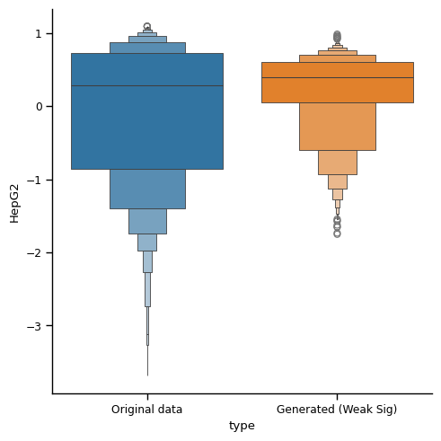

# Diffusion for Biological Sequences 

## What is this code about?  

See tutorials. Each notebook is self-contained. 

* ``Enhancer_data_collection.ipynb``: Get raw data (x, y) and how we make labels from y
* ``Enhancer_diffusion_training.ipynb``: Train conditional diffusion models (Score-based Diffusion over Simplex)
* ``Enhancer_evaluation.ipynb``: Evaluate the performances of conditional diffusion models
* ``Enhancer_oracle_training.ipynb``: Train oralcles

**Conditional generations**. The following is a DNA sequnece (enhancer) conditioning with high property.  


The following is an UTR sequence conditioning with high property. 




Several remarks 
* Enhancer dataset: Refer to https://www.biorxiv.org/content/10.1101/2023.08.08.552077v1 
* UTR dataset: Refer to https://www.ncbi.nlm.nih.gov/geo/query/acc.cgi?acc=GSE114002
* Current backbone diffusion models are https://arxiv.org/abs/2305.10699


## Enviroments needed 

If we have gReLU package (https://github.com/Genentech/gReLU), that would work. 
```
conda install pytorch torchvision torchaudio pytorch-cuda=11.8 -c pytorch -c nvidia
pip install tqdm pandas matplotlib lightning
```


