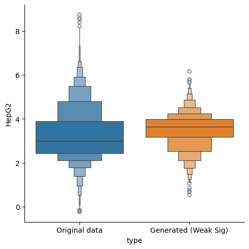

# RL-Based Fine-Tuning for Bilological Sequences 


## What is this code about?  

This is a tutorial on the review (turoail paper) for RL-based-fine-tuniing.  Especially, we focus on the design of biological sequences like DNA (enhancer), RNA (UTR) design. 


# Tutorials

See tutorial folder. Each notebook is self-contained. 

* [1-UTR_data.ipynb](tutorials/UTR/1-UTR_data.ipynb) : Get raw data (x, y) and how we make labels from y
* [2-UTR_diffusion_training.ipynb](tutorials/UTR/2-UTR_diffusion_training.ipynb): Train conditional and unconditional diffuison models (score-based Diffusion over Simplex in )
* [3-UTR_evaluation](tutorials/UTR/3-UTR_evaluation.ipynb): Evaluate the perfomance of conditional generative models
* [4-UTR_finetune_directbackprop](tutorials/UTR/4-UTR_finetune_directbackprop.ipynb): Main fine-tuning code with direct reward backpropagation 
* [5-UTR_finetune_PPO.ipynb](tutorials//UTR/5-UTR_finetune_PPO.ipynb):  Main fine-tuning code with PPO  
* [Oracle_training](tutorials/UTR/UTR_oracle_training.ipynb): Make rewards models from the dataset (sequence, activity)

We can make generate gudided sequences. The following is a DNA sequnece (enhancer) before/after fine-tuning. We optmize an acitivity level. 

 


The following is a UTR sequence before/after fine-tuning. We optimize a MRL (acitivty). 

  


### Severel remarks 
* Enahcer dataset: Refer to https://www.biorxiv.org/content/10.1101/2023.08.08.552077v1 
* UTR dataset: Refer to https://www.ncbi.nlm.nih.gov/geo/query/acc.cgi?acc=GSE114002
* Current backbone diffusion models for fine-tuning are Dirichlet Diffusion Models in  https://arxiv.org/abs/2305.10699 (We acknolwedge that we borrow the code from their code in some part)
* Reward models are based on the Enformer, which is one of the most common models for DNA sequecen modeling. 


### Rquired enviroments 

If we have GRELU package (https://github.com/Genentech/gReLU), that would work. 
```
conda install pytorch torchvision torchaudio pytorch-cuda=11.8 -c pytorch -c nvidia
pip install tqdm pandas matplotlib lightning
```


