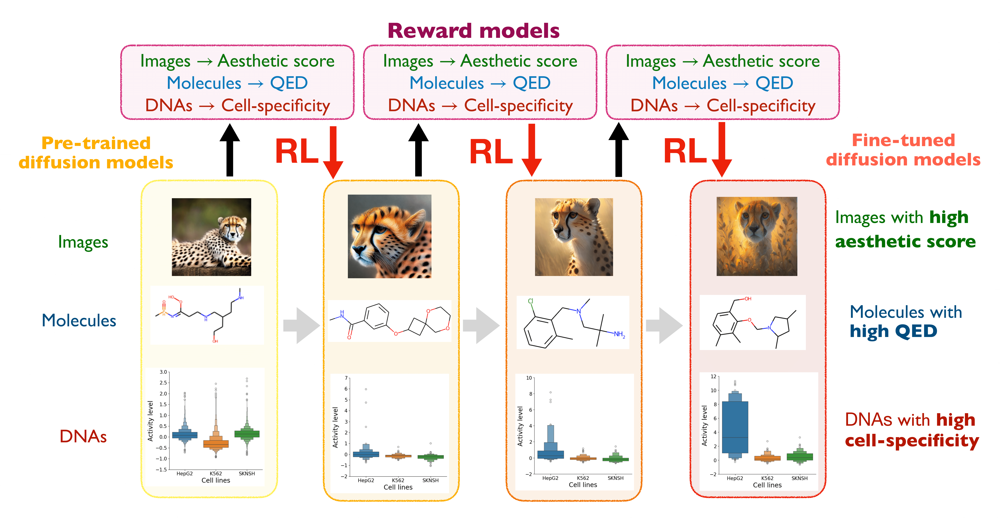
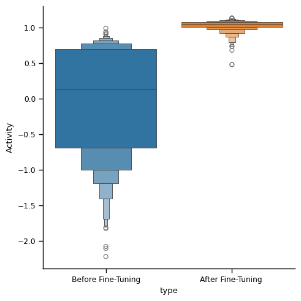
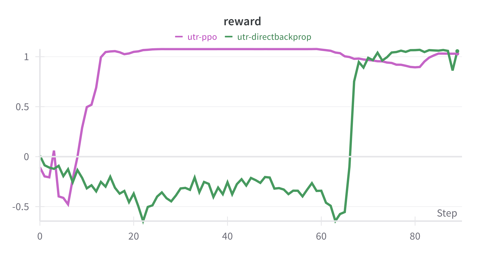
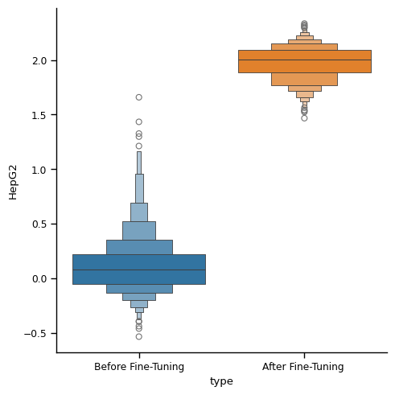
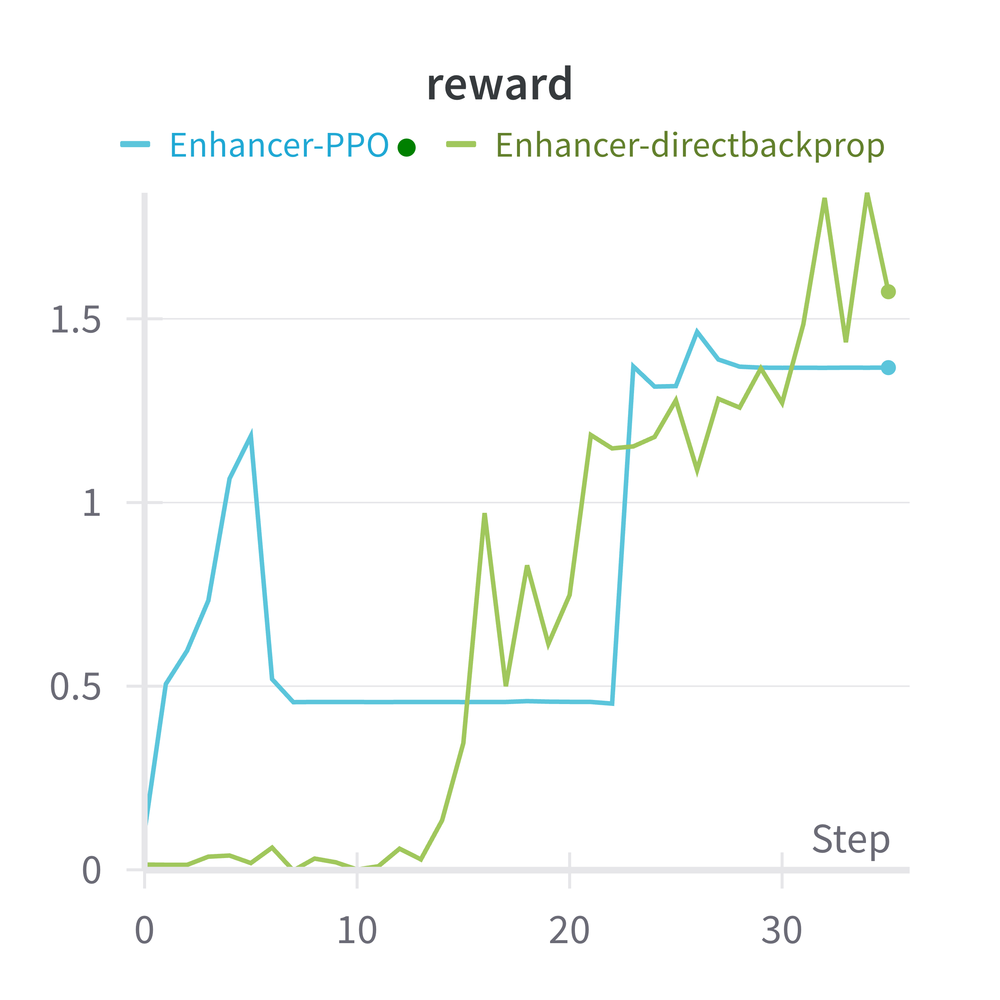

# RL-Based Fine-Tuning of Diffusion Models for Biological Sequences  

This code accompanies the [tutorial/review paper](https://arxiv.org/abs/2407.13734) on RL-based fine-tuning, where the objective is to maximize downstream reward functions by fine-tuning diffusion models with reinforcement learning (RL). In this implementation, we focus on the design of biological sequences, such as DNA (enhancers) and RNA (UTRs).



## Tutorials

See ```./tutorials```. Each notebook is self-contained.

* [1-UTR_data.ipynb](tutorials/UTR/1-UTR_data.ipynb): Obtain raw data and proprocess.
* [2-UTR_diffusion_training.ipynb](tutorials/UTR/2-UTR_diffusion_training.ipynb): Train conditional and unconditional diffuison models (Score-based Diffusion over Simplex).
* [3-UTR_evaluation.ipynb](tutorials/UTR/3-UTR_evaluation.ipynb): Evaluate the performances of the pre-trained diffusion models.
* [4-UTR_finetune_directbackprop.ipynb](tutorials/UTR/4-UTR_finetune_directbackprop.ipynb): Main fine-tuning code with direct reward backpropagation.  
* [5-UTR_finetune_PPO.ipynb](tutorials//UTR/5-UTR_finetune_PPO.ipynb):  Main fine-tuning code with PPO.  
* [Oracle_training](tutorials/UTR/UTR_oracle_training.ipynb): Train reward models from offline dataset, in which the samples are (x=sequence, y=activity level) pairs.

The following compares the generated RNA sequences (UTR )before/after fine-tuning. We optimize towards MRL (activity level).  

 

The following compares the generated DNA sequences (enhancer) before/after fine-tuning. We optimize towards activity level in HepG2 cell line.  

 

### Remarks  

* We use **Dirichlet Diffusion Models** [(Avedeyev et.al, 2023)](https://arxiv.org/abs/2305.10699) as the backbone diffusion models. We acknowledge that our implementation is partly based on their codebase. We will implement more backbone diffusion models that are tailored to sequences.

* Is **over-optimization** happening in the fine-tuning process?: Check paper [BRAID (Uehera and Zhao et.al, 2024)](https://arxiv.org/abs/2405.19673) on how to avoid it.

* **Lab-in-the-loop** setting? : Check out [SEIKO](https://github.com/zhaoyl18/SEIKO), implementation of online diffusion model fine-tuning, as well as the paper [(Uehara and Zhao et.al, 2024)](https://arxiv.org/abs/2402.16359).

### Acknowledgement

* In training reward models, we use Enformers [(Avset et al., 2021)](https://www.nature.com/articles/s41592-021-01252-x), one of the most common architectures for DNA sequence modeling. We use [gReLU](https://github.com/Genentech/gReLU) package for ease of implementation.  
* The enhancer dataset is provided by [Gosai et al., 2023](https://www.biorxiv.org/content/10.1101/2023.08.08.552077v1).
* The UTR dataset is provided by [Sample et al., 2019](https://www.ncbi.nlm.nih.gov/geo/query/acc.cgi?acc=GSE114002).

### Installation  

Create a conda environment with the following command:

```bash
conda create -n bioseq python = 3.12.0
conda activate bioseq
pip install -r requirements.txt
```

### Citation

If you find this work useful in your research, please cite:

```bibtex
@article{Uehara2024understanding,
  title={Understanding Reinforcement Learning-Based Fine-Tuning of Diffusion Models: A Tutorial and Review},
  author={Uehara, Masatoshi and Zhao, Yulai and Biancalani, Tommaso and Levine, Sergey},
  journal={arXiv preprint arXiv:2407.13734},
  year={2024}
}
```
