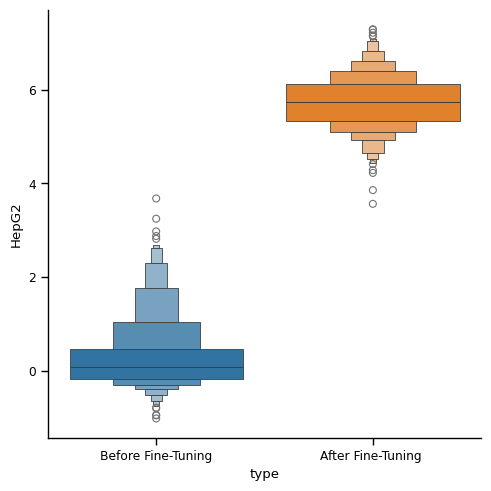

# RL-Based Fine-Tuning for Biological Sequences  

This is a code for the tutorial/review paper on RL-based-fine-tuning, which aims to optimize down-stream reward functions.  In this code, we especially focus on the design of biological sequences such as DNA (enhancers) and RNA (UTRs) by fine-tuning diffusion models with RL.


## Tutorials

See notebooks in the tutorial folders. Each notebook is self-contained. There is also the corresponding notebooks for the optimization of enhancers.  

* [1-UTR_data.ipynb](tutorials/UTR/1-UTR_data.ipynb): Get raw data (x, y) and make labels from y
* [2-UTR_diffusion_training.ipynb](tutorials/UTR/2-UTR_diffusion_training.ipynb): Train conditional and unconditional diffuison models (score-based Diffusion over Simplex)
* [3-UTR_evaluation.ipynb](tutorials/UTR/3-UTR_evaluation.ipynb): Evaluate the perfomances of the generative models
* [4-UTR_finetune_directbackprop.ipynb](tutorials/UTR/4-UTR_finetune_directbackprop.ipynb): Main fine-tuning code with direct reward backpropagation  
* [5-UTR_finetune_PPO.ipynb](tutorials//UTR/5-UTR_finetune_PPO.ipynb):  Main fine-tuning code with PPO  
* [Oracle_training](tutorials/UTR/UTR_oracle_training.ipynb): Train reward models from offline dataset, in which the samples are (sequence, activity) pairs.

The following compares the generated RNA sequences (UTR )before/after fine-tuning. We optimize towards MRL (activity level).  

 

The following compares the generated DNA sequences (enhancer) before/after fine-tuning. We optimize towards activity level in HepG2 cell line.  

 

### Remarks  

* Current backbone diffusion models for fine-tuning are Dirichlet Diffusion Models raised by [Avedeyev et.al, 2023](https://arxiv.org/abs/2305.10699) (We acknowledge that our implementation is partly based on their codebase. We will implement more backbone diffusion models that are tailored to sequences in the future.)

* Is over-optimization happening?: Check paper [(Uehera and Zhao et.al, 2024)](https://arxiv.org/abs/2405.19673) on how to avoid it.

* Lab-in-the-loop fine-tning? : Check out Yulai's online fine-tuning implementation at [[SEIKO]](https://github.com/zhaoyl18/SEIKO) and the corresponding paper [(Uehara and Zhao et.al, 2024)](https://arxiv.org/abs/2402.16359).

### Acknowledgement

* Reward models are based on the enformers [(Avset et al., 2021)](https://www.nature.com/articles/s41592-021-01252-x), one of the most common architectures for DNA sequence modeling. We use GRelu package for ease of implementation.  
* Enhancer dataset is provided by [Gosai et al., 2023](https://www.biorxiv.org/content/10.1101/2023.08.08.552077v1).
* UTR dataset is provided by [Sample et al., 2019](https://www.ncbi.nlm.nih.gov/geo/query/acc.cgi?acc=GSE114002).

### Installation  

Create a conda environment with the following command:

```bash
conda create -n bioseq python=3.12.0
conda activate bioseq
pip install -r requirements.txt
```

### Citation

If you find this work useful in your research, please cite: